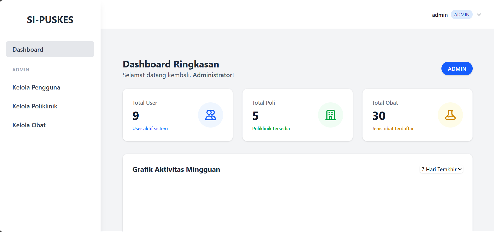

# SI-PUSKES (Sistem Informasi Puskesmas) 🏥

**SI-PUSKES** adalah aplikasi berbasis web untuk manajemen operasional Puskesmas, mulai dari pendaftaran pasien, rekam medis elektronik, manajemen farmasi, hingga pembayaran kasir.

Aplikasi ini dibangun sebagai tugas kuliah Rekayasa Perangkat Lunak untuk mendigitalkan alur kerja Puskesmas.




---

## 🚀 Fitur Utama

Aplikasi ini mencakup modul-modul berikut sesuai *Use Case Scenario*:

* **🔐 Autentikasi & Role Management**
    * Multi-level user: Admin, Pendaftaran, Dokter, Apoteker, Kepala Puskesmas.
    * Keamanan menggunakan Password Hashing & Middleware Authorization.

* **📋 Modul Pendaftaran (Front Office)**
    * Pencarian data pasien (NIK/Nama).
    * Registrasi Pasien Baru dengan **Auto-Generate No. RM** (Rekam Medis).
    * Pendaftaran Kunjungan ke Poli (Umum, Gigi, KIA, dll).

* **🩺 Modul Pemeriksaan (Dokter)**
    * Dashboard Antrean Pasien per Poli.
    * Input Rekam Medis (Anamnesa, Diagnosa, Tanda Vital).
    * **E-Resep:** Input obat & dosis (Cart System).
    * Melihat Riwayat Rekam Medis Pasien sebelumnya.

* **💰 Modul Kasir**
    * Otomatisasi hitung tagihan (Jasa Poli + Total Harga Obat).
    * Dukungan status penjamin: **Umum** (Bayar Tunai) atau **BPJS** (Gratis/Klaim).
    * Cetak Struk Pembayaran (Simulasi).

* **💊 Modul Farmasi & Obat**
    * Master Data Obat & Stok.
    * Penerimaan Resep dari Dokter & Konfirmasi Penyerahan Obat.

* **📊 Modul Kepala Puskesmas**
    * Laporan Kunjungan per Poli.
    * Laporan 10 Penyakit Terbanyak.
    * Laporan Pemakaian Obat.

---

## 🛠 Teknologi yang Digunakan

* **Backend:** Laravel 
* **Frontend:** Livewire + Tailwind CSS 
* **Database:** MySQL
* **Environment:** Docker (Laravel Sail)
* **Tunneling:** Ngrok (Untuk akses publik/demo)

---

## 📦 Cara Instalasi & Menjalankan (Via Docker)

Pastikan di komputer Anda sudah terinstall **Docker Desktop** dan statusnya *Running*.

### 1. Clone Repository
```bash
git clone [https://github.com/septianof/si-puskes.git](https://github.com/septianof/si-puskes.git)
cd si-puskes

### 2. Clone Repository
cp .env.example .env

### 3. Jalankan Container (Build)
docker compose up -d

### 4. Install Dependency & Database
# Install Paket PHP & Frontend
docker compose exec laravel.test composer install
docker compose exec laravel.test npm install

# Build Aset CSS (Tailwind)
docker compose exec laravel.test npm run build

# Migrasi Database & Seeding Data Dummy
docker compose exec laravel.test php artisan migrate:fresh --seed

### 5. Akses Aplikasi
run docker
docker compose up -d

Buka browser dan akses alamat berikut:
http://localhost:8000

### 6. Akun Demo (Login)
| Role | Username | Password | Deskripsi Tugas |
| --- | --- | --- | --- |
| Admin | admin | password123 | Mengelola User & Master Data (Poli/Obat) |
| Pendaftaran | pendaftaran | password123 | Mendaftarkan Pasien & Kasir Pembayaran |
| Dokter | dokter_umum | password123 | Memeriksa Pasien (Poli Umum) |
| Dokter | dokter_gigi | password123 | Memeriksa Pasien (Poli Gigi) |
| Dokter | dokter_kia | password123 | Memeriksa Pasien (Poli KIA) |
| Dokter | dokter_lansia | password123 | Memeriksa Pasien (Poli Lansia) |
| Dokter | dokter_tb | password123 | Memeriksa Pasien (Poli TB) |
| Apoteker | apoteker | password123 | Mengelola Stok & Resep Obat |
| Kepala | kepala | password123 | Melihat Laporan Kunjungan |

Untuk lebih jelasnya bisa dilihatdi file database/seeders/UserSeeder.php